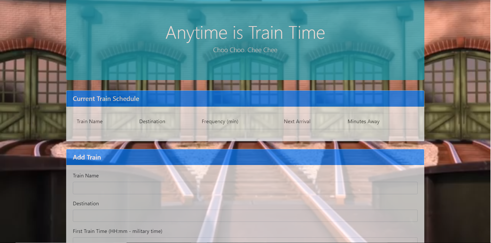

# TrainScheduler

[Link to website](https://darryljltolentino.github.io/TrainScheduler/)

This website features a train schedule which keeps track of train names, their destination, the frequency of the trains, the time of the next train arrival and how many minutes until the next train. The table starts empty. After the user fills out the form and hits submit, all inputs are pushed into the root directory of a firebase. Then firebase is called to get the inputs and put them within a table row which is then appended to the train schedule table. Next Arrival and Minutes away are based on a conversion of the first train departure. The first train input is saved via snapshot from the firebase database. Then it is converted into an "HH:mm" format. Then the difference in time is based on the difference between the converted time and the current time. Remaining time is calculated by the difference in time mod the train frequency. Minutes away is now calculated by taking train frequency and subtracting the remaining time. The next train arrival is the current time plus the minutes away. This is now appended to the table row and displayed.  All the logic was coded using jQuery, JavaScript, Firebase, and the MomentsJs library, while styling and layout of the game was coded in HTML, CSS, and Bootstrap.

######

